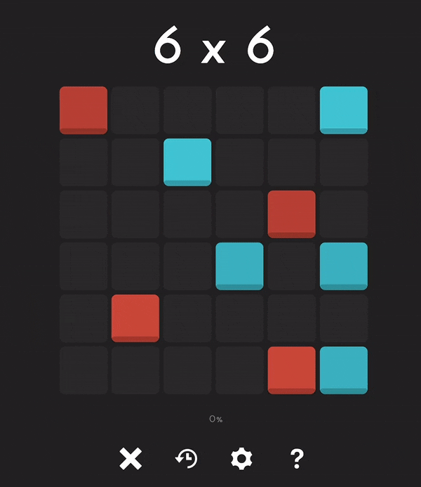

# 0hh1-Puzzle-Solver
This is a solver for the 0hh1 puzzle, also known as Takuzu. 

## Example

## Game principles
The game involves filling in the rest of a *n* x *n* grid, for some even number *n* that is chosen. Each tile within the grid can either be colored red or blue, and a certain number of tiles are already given. This particular web version of the game developed has the option of 4, 6, 8, 10, or 12 for grid sizes. 
The grid must follow three basic rules: 
1. No three consecutive tiles (horizontally or vertically) can be the same color. 
2. Every row and column must have the same number of red and blue tiles. 
3. No two rows can be exactly the same in color ordering, and nor can two columns. 

## How the solver works
### Data collection
### GUI
### Algorithm
